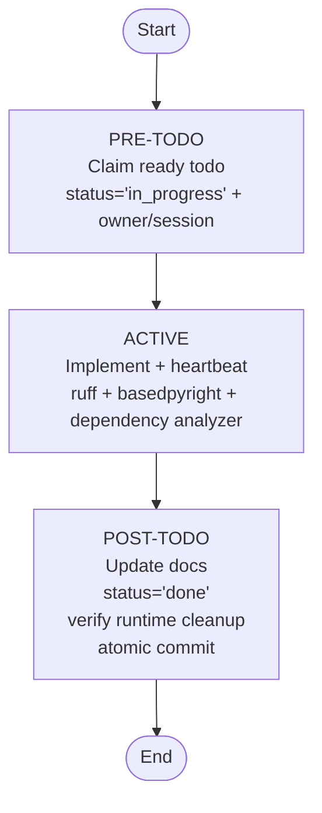

```mermaid
flowchart TB
    S([Start]) --> P["PRE-TODO<br/>Claim ready todo<br/>status='in_progress' + owner/session"]
    P --> A["ACTIVE<br/>Implement + heartbeat<br/>ruff + basedpyright + dependency analyzer"]
    A --> O["POST-TODO<br/>Update docs<br/>status='done'<br/>verify runtime cleanup<br/>atomic commit"]
    O --> E([End])
```
